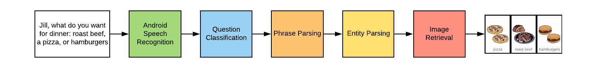

Android Code Sections
===

The Andoid code contains 2 sections. The ListClassifier package, and SpeechClassifier Android Example.

ListClassifier: (./ListClassifier)
---

The Android Package contains three major analytical parts:

- EntityParser
- PhraseParser
- ImageConnector

More details on each portion can be found in the MQP report

