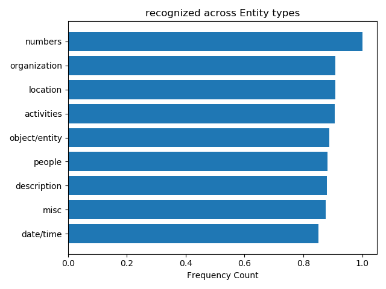
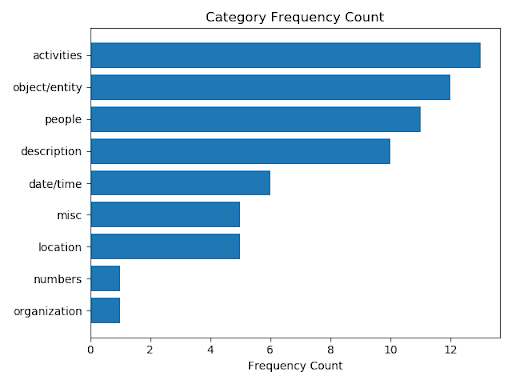

Python Code Sections
===

The python contains 3 sections. The Online Classifier, Label Generation and Evaluation.

The online_api folder is the only one needed in order to deploy a Flask Server
on AWS. It is production quality code.
 
The other two are combinations of various one time scripts that were used to create
data labels and to evaluate the model in our report.

Online Classifier: (./online_api)
---
- Python Online Classifier is a Flask API that was run on  AWS Elastic Beanstalk
- The Python API depends on a AWS RDS MySQL server. The database SQL structures can be found
in the resources folder for the tabels: Tag, Label, Image, Log as well as .tsv file output for
each tabels data.

The online API contains three major analytical parts:

- EntityParser
- PhraseParser
- ImageConnector

More details on each portion can be found in the MQP report


Label Generation: (./label_vocabulary_generation)
---
This section was used to explore various methods for pre-processing
the Tag and Label information to connect Image's to Entity phrases or words

Evaluation: (./evaluation)
---
The evaluation contains the test dataset mturk.csv that was used to evaluate
the performance of the List Classifier as well as functionality
to generate graphs and reports of the performance on these test cases.

Some examples of generated graphs on dataset distribution and model evaluation





```
a3-FirstLastnameMember1-FirstLastnameMember2-FirstLastnameMember3-...
```
